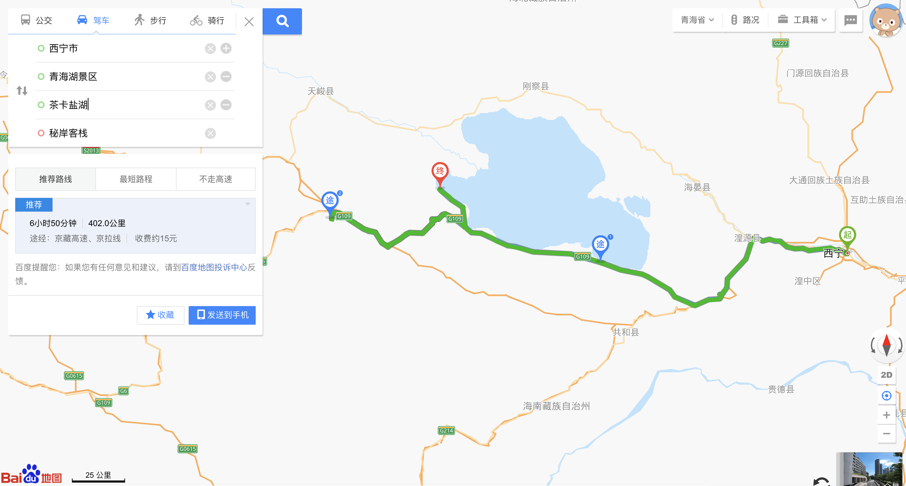
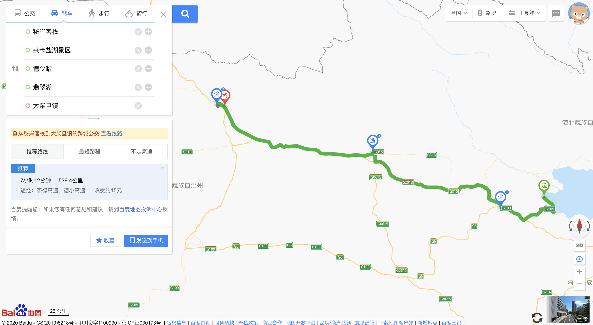
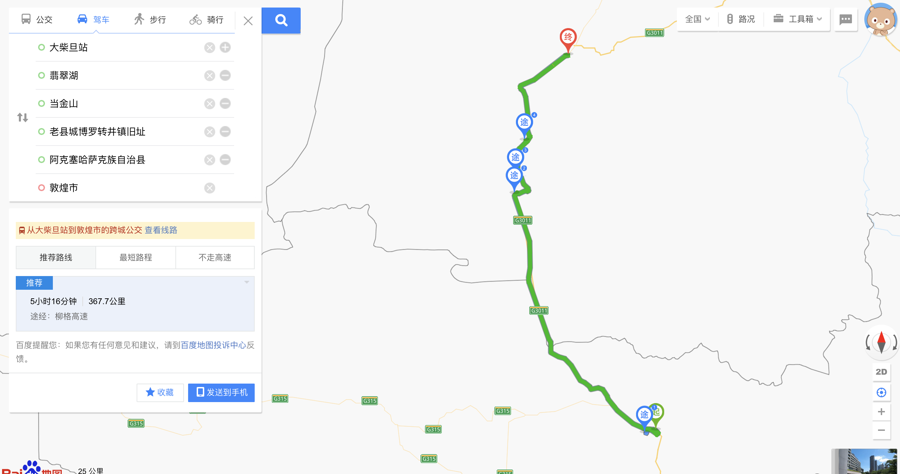
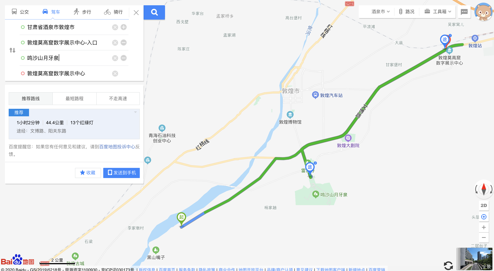

# 西北旅游

### 详细线路

时间|住宿地点|线路|路程|酒店|气温(预估)
-|-|-|-|-|-
19|西宁|取车,购买旅途用品(水,零食)|-|西宁君悦假日酒店|10-20
20|青海湖|西宁->塔尔寺->日月山->青海湖|5小时|秘岸客栈|0-10
21|大柴旦|酒店看日出->茶卡盐湖->翡翠湖->大柴旦|6小时|北纬37度星空营地|4-16
22|敦煌|大柴旦->最美国道315->水上雅丹->西台吉乃尔湖(水上公路)->地上雅丹南八仙->当金山->博罗转井镇->阿克塞->敦煌|9小时|沙漠露营地|9-25
23|敦煌|莫高窟->鸣沙山月牙泉->沙洲夜市|全天敦煌|IU酒店|9-25
24|丹霞|敦煌->瓜州->嘉峪关->七彩丹霞|7小时|-|8-22
25||七彩丹霞->扁都口->门源景观台->达坂山->祁连大草原->黑泉水库->西宁|9小时|-|9-18
25|兰州|西宁->(动车)->兰州|2小时48分钟|-|12-21
26||兰州机场|-|-|12-20

### 各景点详细

日期|景点|票价|时间|备注|状态
-|-|-|-|-|-
20|塔尔寺|70元|2小时左右|入园时间：7:30--17:30，不穿裙子，墨镜，帽子|已购票(飞猪)
20|日月山|途经|-|-|-
20|青海湖|二郎剑景区门票120元||可以不进入，继续沿途一公里|-
21|黑马河日出|藏族人收费，5元||6点-6点半左右|-
21|茶卡盐湖|59|建议2小时|-|已购票
22|最美国道315|途经|-|超美|-
22|水上雅丹|120||尚未开发完全|-
22|雅丹地貌南八仙|途经|-|-|-
22|当金山|||路过,盘山公路|-
22|博罗转井镇|||九层妖塔拍摄|-
23|莫高窟|260元|5小时|早上9点半(提前半小时到达莫高窟集合中心)|已购票(小程序)
23|鸣沙山月牙泉|120元||起风时要保护号手机和相机,傍晚5点左右|-
24|嘉峪关|||天下第一雄关|-
24|七彩丹霞|40元||-|-
25|扁都口和门源|||七八月有油菜花|-
25|达坂山|||开车路途非常凶险|-

### 整体线路

地点|时间|里程
-|-|-
西宁|-|-
塔尔寺|39分钟|28.3公里
日月山|1小时39分钟|91.9公里
青海湖|1小时16分钟|62.1公里
黑马河|1小时18分钟|67.6公里
茶卡盐湖|1小时29分钟|85.3公里
大柴旦(逆向出发)|5小时36分钟|504公里
水上雅丹|2小时41分钟|224.6公里
雅丹地貌|1小时20分钟|114.9公里
最美国道315|-|-
当金山|2小时46分钟|239.9公里
博罗转井镇|40分钟|27.7公里
阿克塞|28分钟|27公里
敦煌|1小时19分钟|78.4公里
瓜州|1小时28分钟|122.3公里
嘉峪关|2小时38分钟|258公里
七彩丹霞|2小时18分钟|208.7公里
扁都口|2小时23分钟|132.9公里
门源景观台|1小时58分钟|113公里
达坂山|30分钟|14.9公里
祁连大草原|1小时11分钟|67.5公里
西宁|3小时30分钟|188.1公里

### 预定项目

名字|平台|费用|日期
-|-|-|-
西宁君悦假日酒店|飞猪|464.4|19
秘岸客栈|携程|606|20
海西大柴旦北纬37度星空营地|去哪儿|568|21
沙漠露营地|美团|590|22
IU酒店|美团|538|23
租车|携程||
塔尔寺|飞猪|280|20
茶卡盐湖|微信公众号|236|21
莫高窟|微信小程序|952|23

### 租车

携程租车，本田crv，19日曹家堡机场12点取车，25日西宁站19:30还车

### 必备物品

* 防晒霜、充电宝、离线地图
* 超市: 洗漱用品、毛巾、拖鞋、保鲜袋、小刀、纸巾、矿泉水、食品(干粮、水果)
* 单反、小型望远镜、药(感冒冲剂、坏肚子药、板蓝根)

### 特别注意

* 驾驶证、身份证
* 国道和省道限速
* 拍照注意当地人所要金钱
* 租车咨询汽油，手机支架，途中车辆故障急救

### 衣服常规配置

* 冲锋衣
* 便携羽绒服
* 薄外套
* 长裤*3
* 保暖裤
* 加绒卫衣
* 长袖T恤
* 半袖T恤
* 帽子
* 墨镜
* 一次性袜子

### 线路图片

20:

21:

22:

23:

