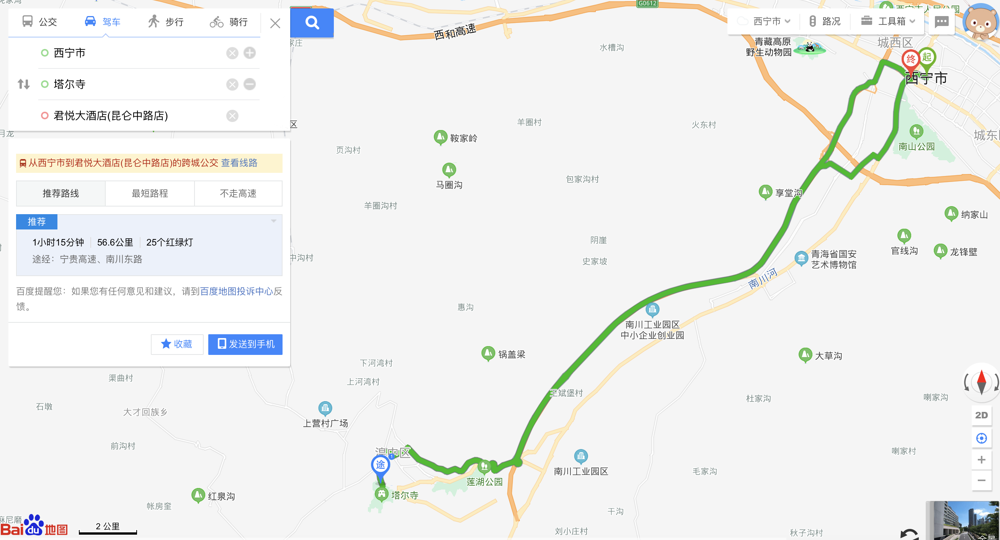
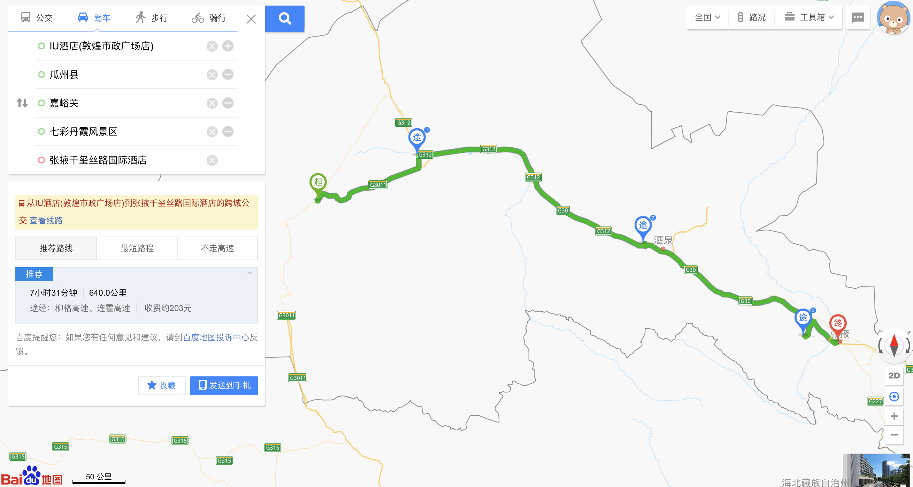
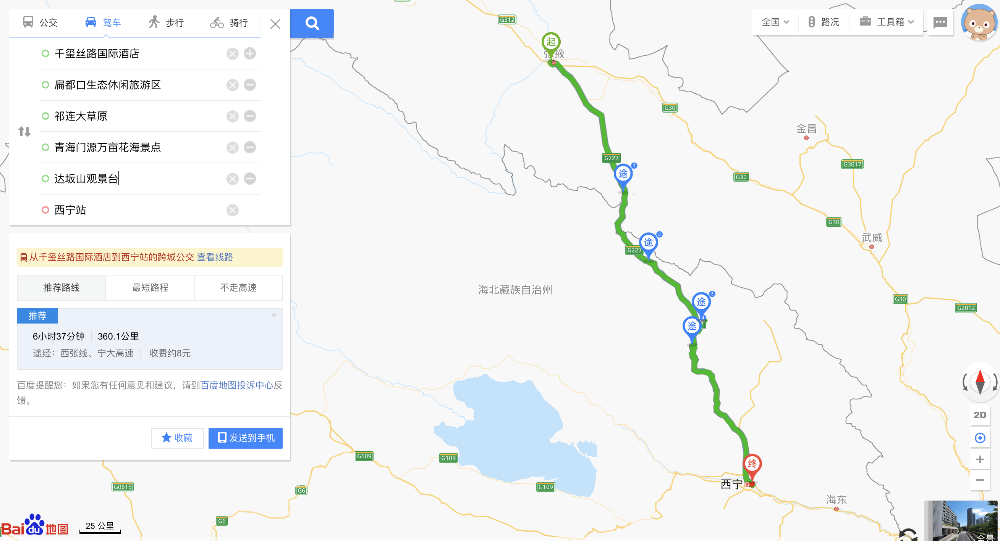
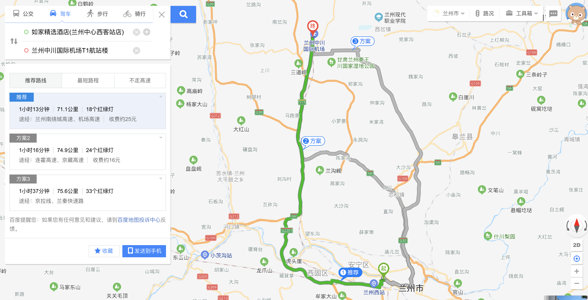
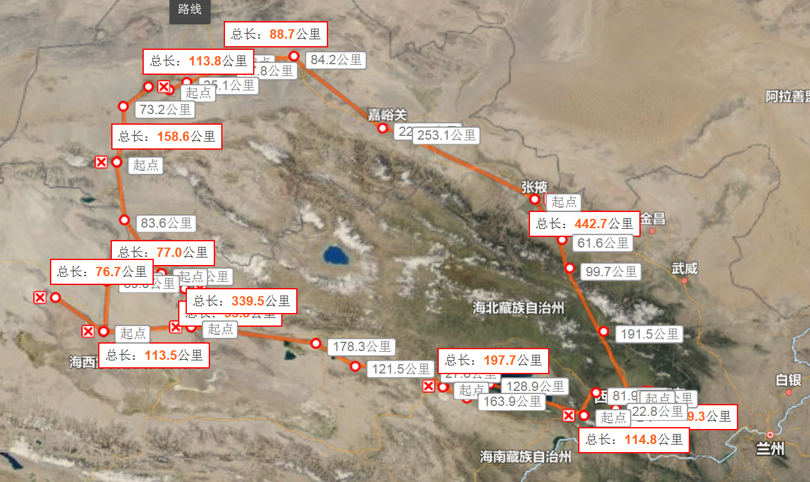

# 西北旅游

### 整体线路

时间|住宿地点|线路|路程|酒店|备注
-|-|-|-|-|-
19|西宁|取车->塔尔寺(14:00)->西宁,购买旅途用品(水,零食)|-|西宁君悦假日酒店|超市、天猫半日达购买旅途用品
20|青海湖|西宁->日月山->青海湖(11:00)->茶卡盐湖(14:00)->秘岸客栈|6小时50分钟|秘岸客栈|西宁早餐,20日19:18日落,21日7:05日出
21|大柴旦|秘岸客栈->德令哈外星人遗址景区->水上雅丹(16:00)->西台吉乃尔湖(水上公路)->地上雅丹南八仙->大柴旦|11小时15分钟|北纬37度星空营地|22日07:01日出
22|敦煌|大柴旦->翡翠湖->当金山->博罗转井镇->阿克塞->阳关景区->敦煌露营地(18:00)|6小时13分钟|沙漠露营地|22日19:38日落,23日07:30日出
23|敦煌|莫高窟->鸣沙山月牙泉->沙洲夜市|全天敦煌|IU酒店|23日19:36日落,24日07:31日出
24|张掖|敦煌->瓜州->嘉峪关关城(11:30)->七彩丹霞(16:30)->张掖|7小时|张掖千玺丝路国际酒店|24日19:12日落
25||张掖->扁都口->门源景观台->达坂山->祁连大草原->黑泉水库->西宁|9小时|-|-
25|兰州|西宁->(动车)->兰州|2小时48分钟|如家精选酒店(西客站店)|-
26||兰州市区->兰州机场|1小时13分钟|-|-

### 各景点详细

日期|景点|票价|时间|备注|状态
-|-|-|-|-|-
19|塔尔寺|70元|7:30--17:30(2小时左右)|不穿裙子，墨镜，帽子|已购票
20|日月山|途经|-|-|-
20|青海湖|二郎剑景区门票120元||可以不进入，继续沿途一公里|-
20|茶卡盐湖|30元|8:00-21:30|建议游玩2小时(走进去,坐小火车出,50元一人)|已购票
21|最美国道315|途经|-|超美|-
21|水上雅丹|120元|8:00-20:00|尚未开发完全|已购票
21|西台吉乃尔湖|||水上公路|-
21|雅丹地貌南八仙|途经|-|-|-
22|翡翠湖||-|-|-
22|当金山|||路过,盘山公路|-
22|博罗转井镇|30元||九层妖塔拍摄|-
22|阳关遗址|38元||二维码进入|已购票
23|莫高窟|260元|9:00(预计3.5小时)|9:30(提前30分钟到达莫高窟集合中心)|已购票(小程序)
23|鸣沙山月牙泉|120元||起风时要保护号手机和相机,傍晚5点左右,提前5天购票|-
23|又见敦煌表演|268元||提前三天购票|
24|嘉峪关关城|108元||天下第一雄关|-
24|七彩丹霞|73元|12:00-18:00|19:14日落|-
25|扁都口和门源|||七八月有油菜花|-
25|达坂山|||开车路途非常凶险|-
25|西宁站->兰州|58元|20:38|高铁|已购票

### 美食

名称|地点|位置|备注
-|-|-|-
手抓羊肉|西宁|益鑫羊肉手抓馆|网红店,需排队
烤羊肉|西宁|尕穆萨美食城(海悦酒店对面)|可以手抓和烤各一半(尕面片,烤馍)
牛奶鸡蛋醪糟(laozao)|西宁||
臊子面|西宁||
藏族餐|塔尔寺||雪神宫或德基庄园
-|青海湖|秘岸酒店|
炕锅羊肉|啊啦吧啦特色主题餐厅|茶卡镇|
牦牛骨汤|三江源牦牛大骨汤|茶卡镇|
驴肉黄面|顺张黄面馆|敦煌|
杏皮水||敦煌|
胡羊焖饼||敦煌|

### 路线天气

地点|日期|温度|备注
-|-|-|-
西宁|19|11-19|多云-小雨
塔尔寺|19|7-19|阴
西宁|20|8-16|雨
青海湖|20|8-18|雨
茶卡盐湖|20|4-16|雨
青海湖|21|5-16|多云
水上雅丹|21|1-14|多云
大柴旦|21|0-13|晴
大柴旦|22|0-12|晴
阿克塞|22|6-24|晴
阳关|22|8-22|晴
敦煌|22|6-27|晴
敦煌|23|6-25|多云
敦煌|24|8-25|晴
瓜州|24|7-24|晴
嘉峪关|24|10-20|晴
七彩丹霞|24|5-21|晴
张掖|24|5-21|晴
张掖|25|6-21|晴
祁连县|25|-3-11|雨
西宁|25|1-17|多云
兰州|25|8-21|雨
兰州|26|10-23|晴

### 预定项目

日期|名字|平台|费用
-|-|-|-
19|西宁君悦假日酒店|去哪儿|536(返现78)
20|秘岸客栈|携程|606
21|海西大柴旦北纬37度星空营地|去哪儿|714
22|沙漠露营地|美团|590
23|IU酒店|美团|538
24|张掖千玺丝路国际酒店|携程|510
25|如家精选酒店|去哪儿|434
19 12:00--25 19:30|租车|携程|2951
19|塔尔寺|飞猪|280
20|茶卡盐湖|微信公众号|120
21|水上雅丹|微信公众号|480
22|阳关遗址|飞猪|152
23|莫高窟|微信小程序|952

### 租车

携程租车，本田crv，19日曹家堡机场12点取车，25日西宁站19:30还车

### 必备物品

* 防晒霜、充电宝、离线地图、水壶、多双一次性袜子、口罩、剃须刀
* 超市: 洗漱用品、毛巾、拖鞋、保鲜袋、小刀、纸巾、矿泉水、食品(干粮、水果)、消毒酒精
* 单反、药(感冒冲剂、坏肚子药、板蓝根)
* 无人机、大疆灵眸

### 特别注意

* 驾驶证、身份证
* 副驾留意下一站加油点和景点
* 国道和省道限速
* 拍照注意当地人所要金钱
* 租车咨询汽油，手机支架，途中车辆故障急救
* 适当准备一些1元零钱

### 衣服常规配置

* 冲锋衣 * 1
* 便携羽绒服 * 1
* 薄外套 * 1
* 长裤 * 3
* 保暖裤 * 2
* 加绒卫衣 * 1
* 长袖T恤 * 2
* 半袖T恤 * 2
* 帽子 * 1
* 墨镜 * 1
* 一次性袜子 * n
* 鞋子 * 2

### 整体线路

地点|时间|里程
-|-|-
西宁曹家堡国际机场|-|-
塔尔寺-停车场|1小时|55公里
君悦大酒店(昆仑中路店)|36分钟|28.8公里
青海湖二郎剑景区售票处|3小时1分钟|145.8公里
茶卡盐湖景区|2小时42分钟|150.5公里
秘岸客栈|1小时45分钟|106.8公里
西台吉乃尔湖|8小时13分钟|659.6公里
乌素特(水上)雅丹地质公园|30分钟|36.4公里
青海省南八仙公路段(南八仙)|1小时56分钟|157.7公里
大柴旦|1小时21分钟|100.2公里
37度星空营地|17分钟|20.9公里
翡翠湖|35分钟|28.9公里
当金山|2小时48分钟|220.5公里
阿克塞老县城九层妖塔|33分钟|26.6公里
博罗转井镇|6分钟|1.2公里
阳关景区|1小时9分钟|88.5公里
敦煌市|56分钟|60.5公里
瓜州|1小时28分钟|122.3公里
嘉峪关|2小时38分钟|258公里
七彩丹霞|2小时18分钟|208.7公里
扁都口|2小时23分钟|132.9公里
门源景观台|1小时58分钟|113公里
达坂山|30分钟|14.9公里
祁连大草原|1小时11分钟|67.5公里
西宁|3小时30分钟|188.1公里

### 线路图片

19:

20:

21:

22:

23:

24:

25:

26:

### 完整路线地图

